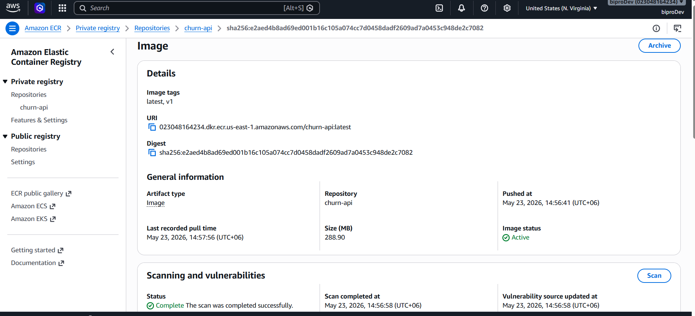
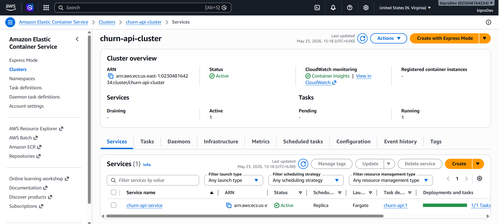
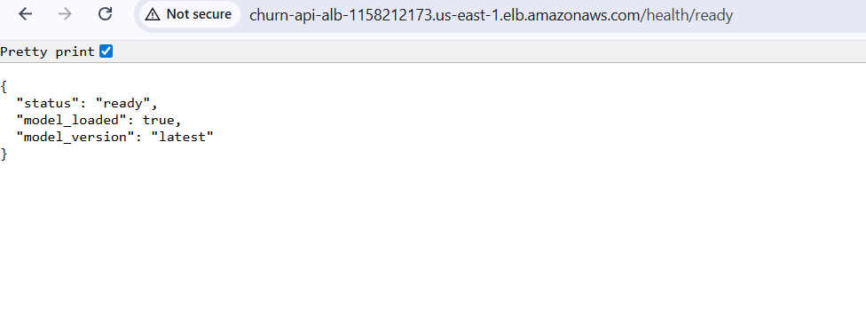
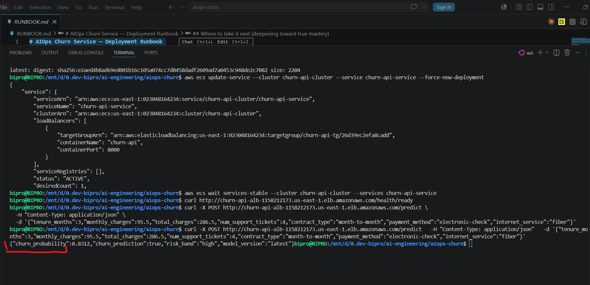

# AIOps Churn Prediction Service

A production-grade machine learning deployment project: a churn-prediction REST API, containerized, deployed to AWS with infrastructure as code, automated CI/CD, and ML observability.

Built to teach **production MLOps end to end**. Start with [`RUNBOOK.md`](./RUNBOOK.md) — it walks you from your laptop to a live API on AWS, step by step.

---

## Architecture

```
                        ┌──────────────────┐
   git push main ──────▶│  GitHub Actions  │  test → build → push → deploy
                        └────────┬─────────┘
                                 │ (OIDC, no static keys)
                                 ▼
                        ┌────────────────┐      ┌─────────────┐
                        │      ECR       │◀─────│   Docker    │ multi-stage,
                        │  (image repo)  │      │   image     │ non-root, slim
                        └────────┬───────┘      └─────────────┘
                                 │ pull
                                 ▼
   Internet ──▶ ALB ──▶ ECS Fargate Service (autoscaled, min 1 / max 4)
                 │              │                        │
            health checks   CloudWatch             FastAPI app
            /health/ready   logs + metrics               │
                                                 /predict (single)
                                                 /predict/batch
                                                 /metrics (Prometheus)
                                                         │
                                                  Grafana dashboard
                                                  drift_detection.py (PSI)
```

---

## Screenshots

### ECR — Docker Image Repository


### ECS — Fargate Service Running


### Health Check — API Ready


### Churn Probability — Live Prediction


---

## What's Inside

| Path | Description |
|------|-------------|
| `app/` | FastAPI service: schemas, config, model wrapper, Prometheus metrics, health checks |
| `app/ml/model.py` | Model loader with `predict_one()` / `predict_batch()` and risk-band classification |
| `training/train.py` | Reproducible training pipeline — sklearn GradientBoosting + MLflow logging |
| `tests/test_api.py` | Pytest suite — runs in CI, gates every deployment |
| `Dockerfile` | Multi-stage, non-root (`appuser`), healthchecked production image |
| `docker-compose.yml` | Local observability stack: API + Prometheus + Grafana |
| `infra/terraform/` | AWS infra as code: ECR, VPC, ALB, ECS Fargate, IAM, autoscaling, CloudWatch |
| `infra/k8s/` | Kubernetes manifests (optional EKS track) with HPA and Ingress |
| `.github/workflows/cicd.yml` | Test-gated CI/CD pipeline with GitHub OIDC auth (no stored AWS keys) |
| `monitoring/prometheus.yml` | Prometheus scrape config (scrapes `/metrics` every 15 s) |
| `monitoring/drift_detection.py` | PSI-based data drift detector — exits non-zero on breach |
| `scripts/load_test.py` | Concurrent traffic generator — observe metrics and autoscaling |
| `Makefile` | Task automation: `install`, `train`, `test`, `lint`, `run`, `compose-up`, `drift` |
| `RUNBOOK.md` | **Step-by-step deployment guide — start here for AWS** |

---

## Prerequisites

| Tool | Version | Used for |
|------|---------|---------|
| Python | 3.12 | Application runtime and training |
| Docker | 24+ | Container build and local stack |
| Terraform | 1.6+ | AWS infrastructure provisioning |
| AWS CLI | v2 | ECR login and ECS deployment |
| GNU Make | any | Task shortcuts |

---

## Quick Start (Local)

```bash
# 1. Install dependencies
make install

# 2. Train the model (outputs app/ml/model.joblib)
make train

# 3. Run the test suite
make test

# 4. Serve the API at http://localhost:8000 (docs at /docs)
make run
```

### Local Observability Stack (API + Prometheus + Grafana)

```bash
make compose-up        # starts all three services
# API      → http://localhost:8000
# Prometheus → http://localhost:9090
# Grafana  → http://localhost:3000  (admin / admin)

make compose-down      # tear down
```

---

## API Endpoints

| Method | Path | Description |
|--------|------|-------------|
| `GET` | `/health/live` | Liveness probe — is the process running? |
| `GET` | `/health/ready` | Readiness probe — is the model loaded? |
| `GET` | `/metrics` | Prometheus metrics |
| `POST` | `/predict` | Single-customer churn prediction |
| `POST` | `/predict/batch` | Batch predictions (1–1000 customers) |
| `GET` | `/docs` | Swagger UI (auto-generated) |

### Example Request

```bash
curl -X POST http://localhost:8000/predict \
  -H "Content-Type: application/json" \
  -d '{
    "tenure_months": 3,
    "monthly_charges": 85.0,
    "contract_type": "month-to-month",
    "num_support_tickets": 4,
    "has_online_security": false,
    "internet_service": "fiber",
    "payment_method": "electronic_check"
  }'
```

### Example Response

```json
{
  "churn_probability": 0.83,
  "churn_prediction": true,
  "risk_band": "high",
  "model_version": "1.0.0"
}
```

**Risk bands:** `low` (< 0.3) · `medium` (0.3–0.6) · `high` (> 0.6)

---

## The Model

- **Algorithm**: `GradientBoostingClassifier` (200 estimators, depth 3, lr 0.05)
- **Preprocessing**: `StandardScaler` for numeric, `OneHotEncoder` for categorical — wrapped in a single sklearn `Pipeline`
- **Training data**: 20,000 synthetic samples (seed=42, fully reproducible — no external dataset needed)
- **Learned signals**: short tenure, month-to-month contract, fiber internet, electronic check payment all correlate with higher churn
- **Metrics tracked**: ROC-AUC, PR-AUC, F1
- **Experiment tracking**: MLflow (optional — set `MLFLOW_TRACKING_URI`)
- **Artifact**: `app/ml/model.joblib` — regenerated fresh on every CI/CD deploy

The patterns (train → version → containerize → deploy → monitor → detect drift → retrain) apply to any model type, including LLMs and computer vision.

---

## CI/CD Pipeline

Defined in `.github/workflows/cicd.yml`. Two jobs:

### `test` (every push + PR)
1. Setup Python 3.12 with pip cache
2. `pip install -r requirements-dev.txt`
3. `ruff check` — linting
4. `pytest tests/` — full test suite

**If tests fail, nothing is built or deployed.**

### `build-and-deploy` (push to `main` only, after `test` passes)
1. Assume AWS IAM role via **GitHub OIDC** (no static keys stored)
2. Login to ECR
3. `make train` — fresh model artifact
4. `docker build` — tagged with git SHA + `latest`
5. `docker push` both tags to ECR
6. `aws ecs update-service --force-new-deployment`
7. `aws ecs wait services-stable` — blocks until healthy

---

## AWS Infrastructure (Terraform)

All infra lives in `infra/terraform/`. Apply with:

```bash
cd infra/terraform
terraform init
terraform apply
```

### Resources Created

| File | Resources |
|------|-----------|
| `ecr.tf` | ECR repository, lifecycle policy (keeps last 10 images) |
| `ecs.tf` | ECS Fargate cluster, service (CPU 512 / mem 1024 MiB), task definition |
| `alb.tf` | Application Load Balancer, listener, target group, health checks on `/health/ready` |
| `network.tf` | Default VPC, public subnets, ALB security group (0.0.0.0:80), task security group (8000 from ALB only) |
| `iam.tf` | Execution role (ECR pull + CloudWatch write), task role (application identity) |
| `outputs.tf` | `ecr_repository_url`, `api_url`, `cluster_name`, `service_name` |

**Autoscaling**: target-tracking on CPU (60% target, min 1 / max 4 tasks).  
**Logs**: CloudWatch log group `/ecs/churn-api`.

### Kubernetes (Optional)

Manifests in `infra/k8s/`:
- `deployment.yaml` — 2 replicas, rolling update, liveness/readiness probes, resource limits
- `service.yaml` — LoadBalancer Service, HPA (CPU-based, 2–6 pods), Ingress

---

## Monitoring & Drift Detection

### Prometheus Metrics (exported at `/metrics`)

| Metric | Type | Description |
|--------|------|-------------|
| `prediction_count_total` | Counter | Total predictions, labelled by `risk_band` |
| `prediction_latency_seconds` | Histogram | End-to-end prediction latency |
| `prediction_errors_total` | Counter | Prediction errors |
| `churn_probability` | Histogram | Distribution of predicted probabilities |

### Drift Detection

```bash
make drift    # runs monitoring/drift_detection.py against prediction logs
```

Compares live feature distributions from API logs against the training baseline using **Population Stability Index (PSI)**:

| PSI | Interpretation |
|-----|---------------|
| < 0.1 | No drift — OK |
| 0.1–0.25 | Moderate drift — investigate |
| > 0.25 | Major drift — **retrain** |

Exits with non-zero status on breach so schedulers and CI can alert.

---

## Load Testing

```bash
python scripts/load_test.py --url http://localhost:8000 --rps 50 --duration 60
```

Generates concurrent requests with random customer features and reports:
- Success rate
- Throughput (req/s)
- Latency percentiles (p50, p95)

Use this to observe ECS autoscaling and populate Grafana dashboards.

---

## Testing

```bash
make test            # run full pytest suite
make lint            # ruff linter check
```

Test coverage in `tests/test_api.py`:
- Liveness and readiness endpoints
- Valid prediction (probability in [0, 1], valid risk band)
- Input validation (rejects invalid enums and out-of-range values with HTTP 422)
- Batch predictions
- Metrics endpoint exposure
- Model learned signal (high-risk customer scores higher than low-risk customer)

---

## Cost

| Track | Monthly Estimate |
|-------|-----------------|
| ECS Fargate (1 task) | ~$15–35 |
| ALB | ~$18 |
| ECR storage | ~$0.10/GB |

Tear down between sessions:

```bash
cd infra/terraform && terraform destroy
```

Set a **billing alert** in AWS before deploying.

---

## Environment Variables

| Variable | Default | Description |
|----------|---------|-------------|
| `MODEL_PATH` | `app/ml/model.joblib` | Path to serialized model |
| `LOG_LEVEL` | `INFO` | Logging verbosity |
| `MLFLOW_TRACKING_URI` | _(unset)_ | MLflow server URL (optional) |
| `AWS_REGION` | — | Required for CI/CD |
| `ECR_REPOSITORY` | — | ECR repo name |
| `ECS_CLUSTER` | — | ECS cluster name |
| `ECS_SERVICE` | — | ECS service name |
| `AWS_ROLE_ARN` | — | IAM role for GitHub OIDC |
